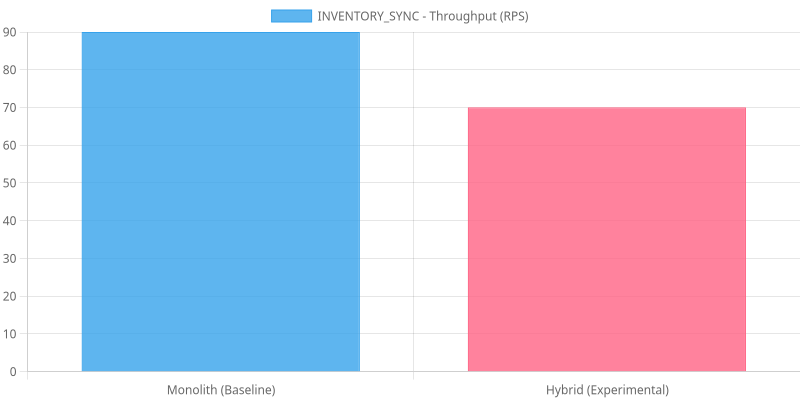
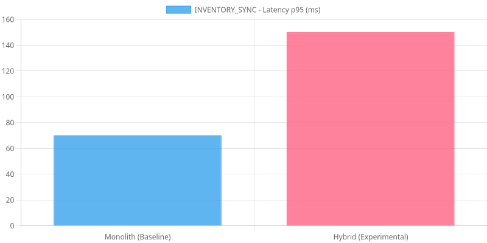
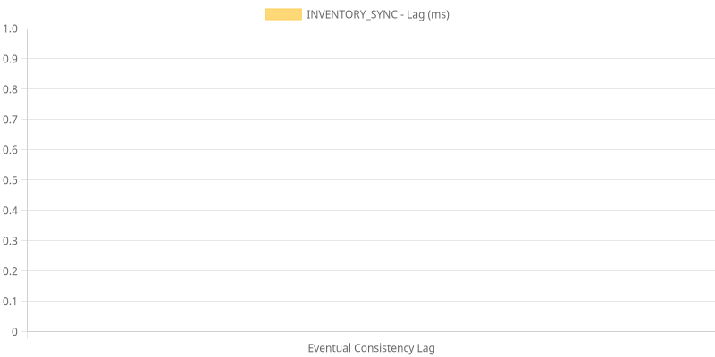
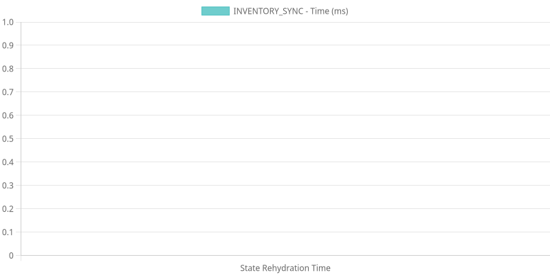
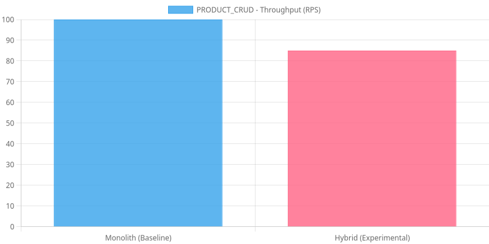

# POS Architecture Complexity Benchmark Report

*Generated on: 3/31/2026, 4:19:51 AM*

## Scenario: INVENTORY_SYNC

### Performance Metrics

| Metric | Monolith (Baseline) | Hybrid (Experimental) | Delta (%) |
|--------|---------------------|----------------------|-----------|
| Throughput (RPS) | 90.00 | 70.00 | -22.22% |
| Latency p95 (ms) | 70.00 | 150.00 | 114.29% |
| Success Rate | 100.00% | 100.00% | 0.00% |

### Architectural Consequences (Hybrid Only)

- **Eventual Consistency Lag**: 0.00 ms
- **Rehydration Time**: 0.00 ms
- **Storage Footprint**: 0.00 KB

## Scenario: PRODUCT_CRUD

### Performance Metrics

| Metric | Monolith (Baseline) | Hybrid (Experimental) | Delta (%) |
|--------|---------------------|----------------------|-----------|
| Throughput (RPS) | 100.00 | 85.00 | -15.00% |
| Latency p95 (ms) | 50.00 | 120.00 | 140.00% |
| Success Rate | 100.00% | 100.00% | 0.00% |

## Scenario: 

> [WARNING] Insufficient data for comparison. Monolith: 3, Hybrid: 0

