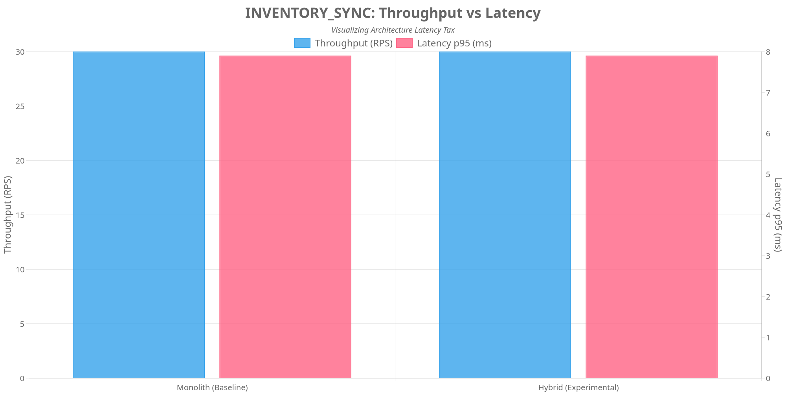
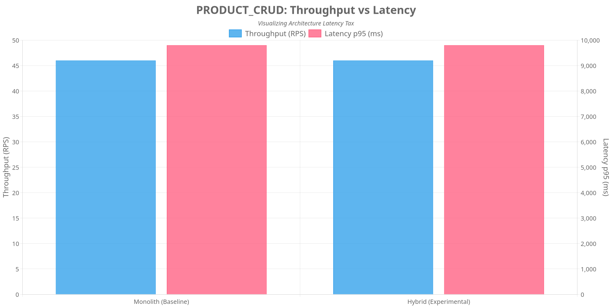
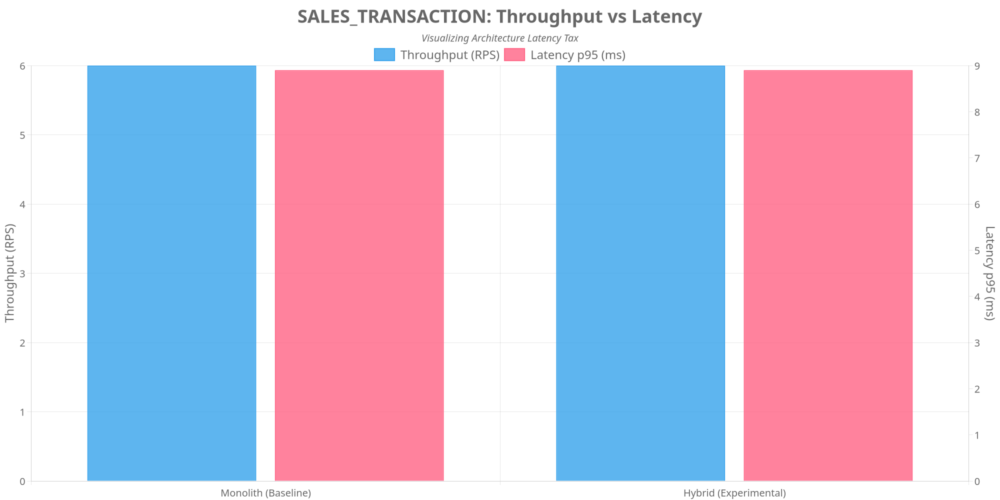

# POS Architecture Complexity Benchmark Report (Enhanced)

*Generated on: 3/31/2026, 10:12:34 AM*

## Scenario: INVENTORY_SYNC

### Performance Metrics

| Metric | Monolith (Baseline) | Hybrid (Experimental) | Delta (%) |
|--------|---------------------|----------------------|-----------|
| Throughput (RPS) | 30.00 | 30.00 | 0.00% |
| Latency p95 (ms) | 7.90 | 7.90 | 0.00% |
| Failure Rate | 60.00% | 60.00% | 0.00% |

### SCS & Complexity Metrics

| Metric | Monolith | Hybrid | Multiplier |
|--------|----------|--------|------------|
| Files Touched | 0 | 0 | NaNx |
| LOC Churn | 0 | 0 | NaNx |

### Architectural Trade-offs

- **Throughput Efficiency**: Reduced by 0.00%
- **Latency Overhead**: Decreased by 0.00%

## Scenario: PRODUCT_CRUD

### Performance Metrics

| Metric | Monolith (Baseline) | Hybrid (Experimental) | Delta (%) |
|--------|---------------------|----------------------|-----------|
| Throughput (RPS) | 46.00 | 46.00 | 0.00% |
| Latency p95 (ms) | 9801.20 | 9801.20 | 0.00% |
| Failure Rate | 40.04% | 40.04% | 0.00% |

### SCS & Complexity Metrics

| Metric | Monolith | Hybrid | Multiplier |
|--------|----------|--------|------------|
| Files Touched | 0 | 0 | NaNx |
| LOC Churn | 0 | 0 | NaNx |

### Architectural Trade-offs

- **Throughput Efficiency**: Reduced by 0.00%
- **Latency Overhead**: Decreased by 0.00%

## Scenario: SALES_TRANSACTION

### Performance Metrics

| Metric | Monolith (Baseline) | Hybrid (Experimental) | Delta (%) |
|--------|---------------------|----------------------|-----------|
| Throughput (RPS) | 6.00 | 6.00 | 0.00% |
| Latency p95 (ms) | 8.90 | 8.90 | 0.00% |
| Failure Rate | 100.00% | 100.00% | 0.00% |

### SCS & Complexity Metrics

| Metric | Monolith | Hybrid | Multiplier |
|--------|----------|--------|------------|
| Files Touched | 0 | 0 | NaNx |
| LOC Churn | 0 | 0 | NaNx |

### Architectural Trade-offs

- **Throughput Efficiency**: Reduced by 0.00%
- **Latency Overhead**: Decreased by 0.00%

