# POS Architecture Complexity Benchmark Report (Enhanced)

*Generated on: 4/6/2026, 8:10:38 PM*

## Scenario: INVENTORY_SYNC

### Architectural Performance Profile

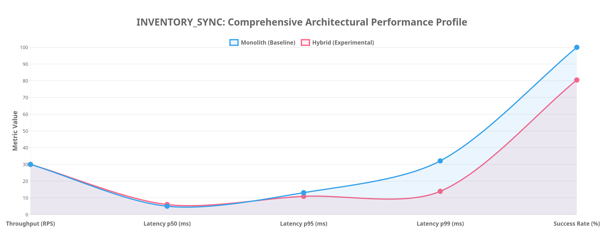

| Metric | Monolith (Baseline) | Hybrid (Experimental) | Delta (%) |
|--------|---------------------|----------------------|-----------|
| Throughput (RPS) | 30.00 | 30.00 | 0.00% |
| Latency p50 (ms) | 5.00 | 6.00 | 20.00% |
| Latency p95 (ms) | 13.10 | 10.90 | -16.79% |
| Latency p99 (ms) | 32.10 | 13.90 | -56.70% |
| Success Rate | 100.00% | 80.47% | -19.53% |

### SCS & Complexity Metrics

| Metric | Monolith | Hybrid | Multiplier |
|--------|----------|--------|------------|
| Files Touched | 52 | 124 | 2.38x |
| LOC Churn | 2094 | 3663 | 1.75x |
| Avg Files/Commit | 9.00 | 10.00 | 1.11x |
| Max Files/Commit | 32 | 56 | 1.75x |

#### Development Type Space Distribution

| Commit Type | Monolith | Hybrid |
|-------------|----------|--------|
| chore | 1 | 2 |
| config | 0 | 1 |
| feat | 4 | 12 |
| fix | 0 | 3 |
| init | 1 | 0 |
| test | 1 | 0 |
| unknown | 1 | 0 |

#### Software Complexity Analysis

- **Cognitive Load**: The Hybrid architecture shows a **11.1% increase** in average files touched per commit.
- **Structural Blast Radius**: Maximum files edited in a single commit is **1.8x** larger in Hybrid, indicating higher cross-component coupling during certain operations.
- **Development Velocity**: Monolith favors more frequent, smaller commits while Hybrid shows larger, more consolidated architectural changes.

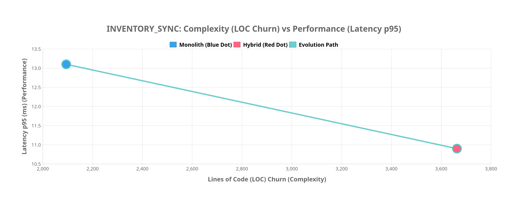

### Architectural Trade-offs

- **Throughput Efficiency**: Reduced by 0.00%
- **Latency Overhead**: Decreased by 16.79%

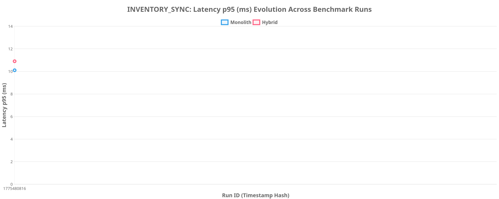

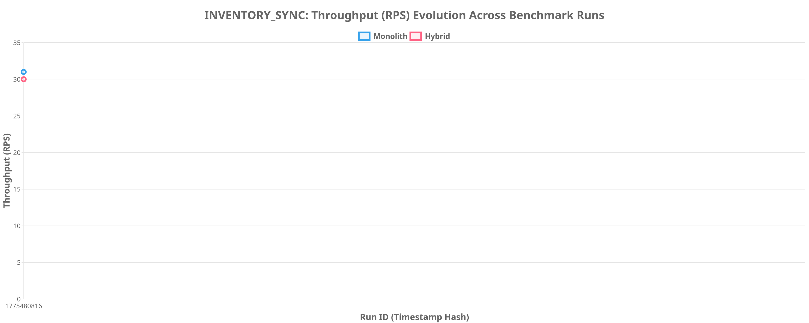

## Scenario: PRODUCT_CRUD

### Architectural Performance Profile

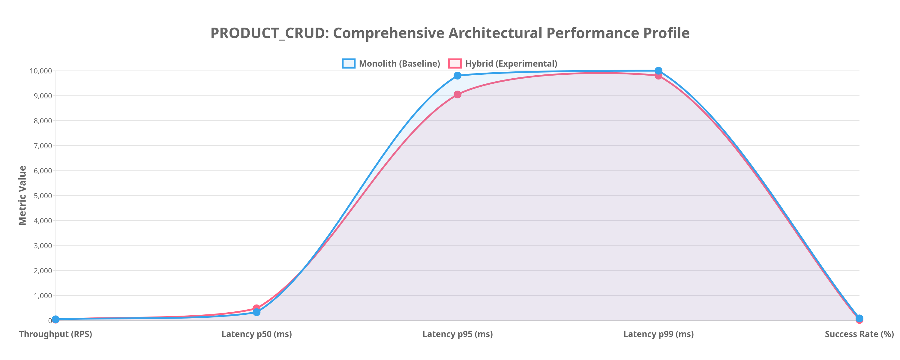

| Metric | Monolith (Baseline) | Hybrid (Experimental) | Delta (%) |
|--------|---------------------|----------------------|-----------|
| Throughput (RPS) | 48.00 | 35.00 | -27.08% |
| Latency p50 (ms) | 333.70 | 487.90 | 46.21% |
| Latency p95 (ms) | 9801.20 | 9047.60 | -7.69% |
| Latency p99 (ms) | 9999.20 | 9801.20 | -1.98% |
| Success Rate | 84.82% | 24.10% | -71.59% |

### SCS & Complexity Metrics

| Metric | Monolith | Hybrid | Multiplier |
|--------|----------|--------|------------|
| Files Touched | 52 | 124 | 2.38x |
| LOC Churn | 2094 | 3663 | 1.75x |
| Avg Files/Commit | 9.00 | 10.00 | 1.11x |
| Max Files/Commit | 32 | 56 | 1.75x |

#### Development Type Space Distribution

| Commit Type | Monolith | Hybrid |
|-------------|----------|--------|
| chore | 1 | 2 |
| config | 0 | 1 |
| feat | 4 | 12 |
| fix | 0 | 3 |
| init | 1 | 0 |
| test | 1 | 0 |
| unknown | 1 | 0 |

#### Software Complexity Analysis

- **Cognitive Load**: The Hybrid architecture shows a **11.1% increase** in average files touched per commit.
- **Structural Blast Radius**: Maximum files edited in a single commit is **1.8x** larger in Hybrid, indicating higher cross-component coupling during certain operations.
- **Development Velocity**: Monolith favors more frequent, smaller commits while Hybrid shows larger, more consolidated architectural changes.

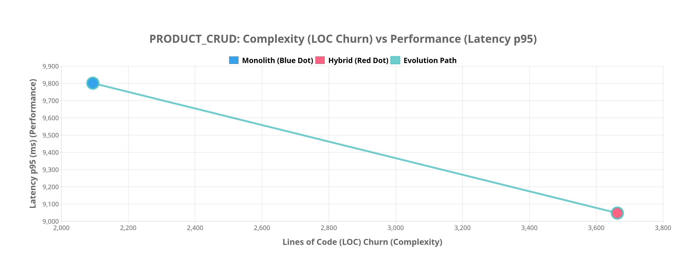

### Architectural Trade-offs

- **Throughput Efficiency**: Reduced by 27.08%
- **Latency Overhead**: Decreased by 7.69%

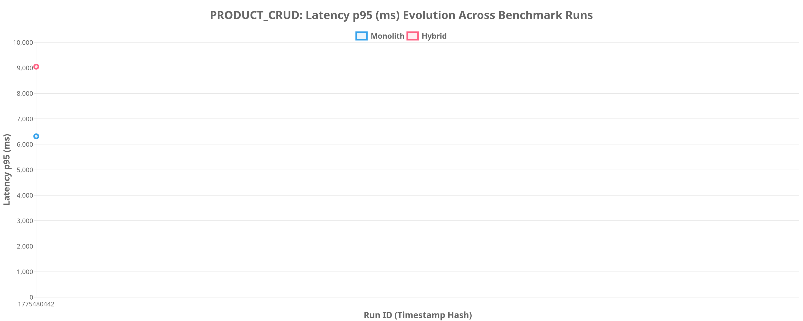

## Scenario: SALES_TRANSACTION

### Architectural Performance Profile

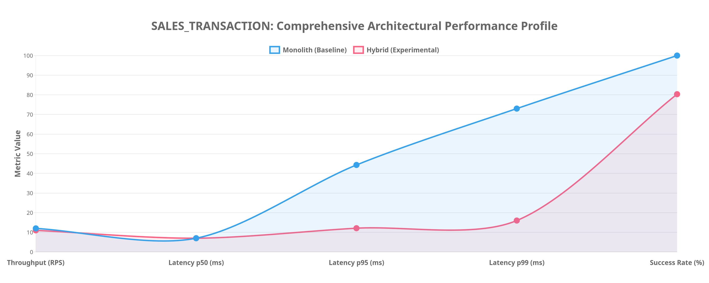

| Metric | Monolith (Baseline) | Hybrid (Experimental) | Delta (%) |
|--------|---------------------|----------------------|-----------|
| Throughput (RPS) | 12.00 | 11.00 | -8.33% |
| Latency p50 (ms) | 7.00 | 7.00 | 0.00% |
| Latency p95 (ms) | 44.30 | 12.10 | -72.69% |
| Latency p99 (ms) | 73.00 | 16.00 | -78.08% |
| Success Rate | 100.00% | 80.33% | -19.67% |

### SCS & Complexity Metrics

| Metric | Monolith | Hybrid | Multiplier |
|--------|----------|--------|------------|
| Files Touched | 52 | 124 | 2.38x |
| LOC Churn | 2094 | 3663 | 1.75x |
| Avg Files/Commit | 9.00 | 10.00 | 1.11x |
| Max Files/Commit | 32 | 56 | 1.75x |

#### Development Type Space Distribution

| Commit Type | Monolith | Hybrid |
|-------------|----------|--------|
| chore | 1 | 2 |
| config | 0 | 1 |
| feat | 4 | 12 |
| fix | 0 | 3 |
| init | 1 | 0 |
| test | 1 | 0 |
| unknown | 1 | 0 |

#### Software Complexity Analysis

- **Cognitive Load**: The Hybrid architecture shows a **11.1% increase** in average files touched per commit.
- **Structural Blast Radius**: Maximum files edited in a single commit is **1.8x** larger in Hybrid, indicating higher cross-component coupling during certain operations.
- **Development Velocity**: Monolith favors more frequent, smaller commits while Hybrid shows larger, more consolidated architectural changes.

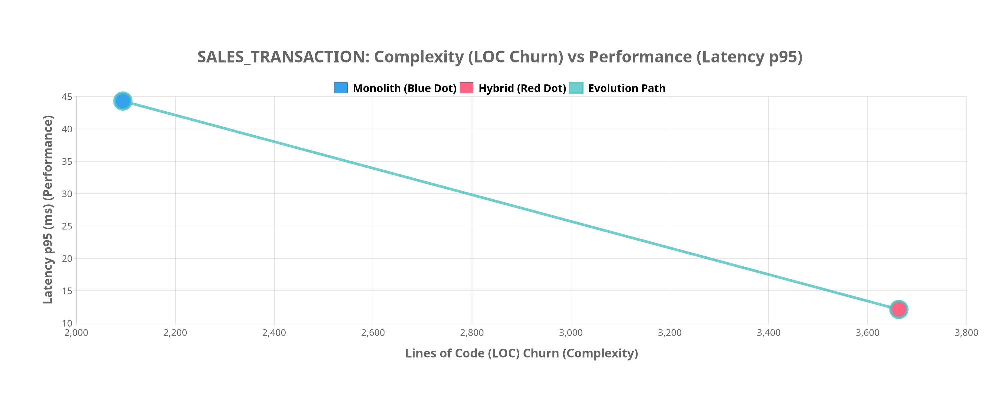

### Architectural Trade-offs

- **Throughput Efficiency**: Reduced by 8.33%
- **Latency Overhead**: Decreased by 72.69%

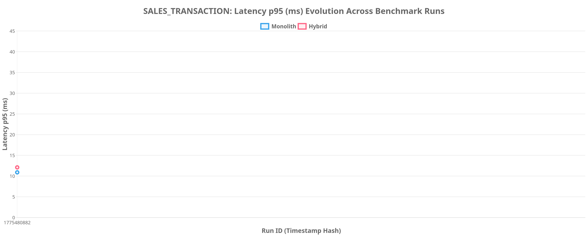

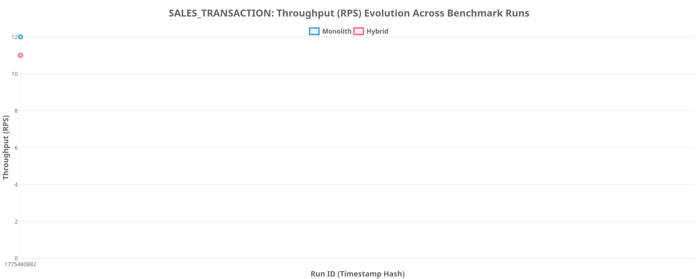

